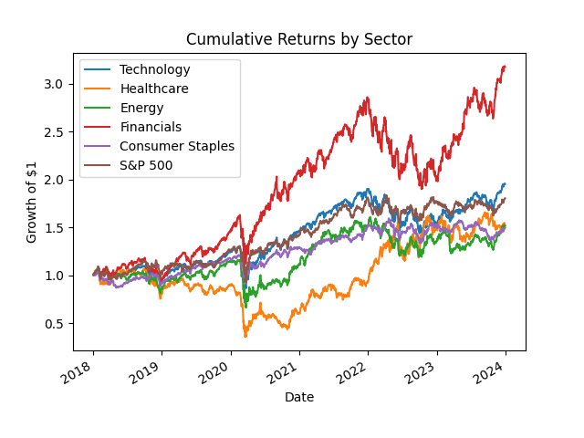
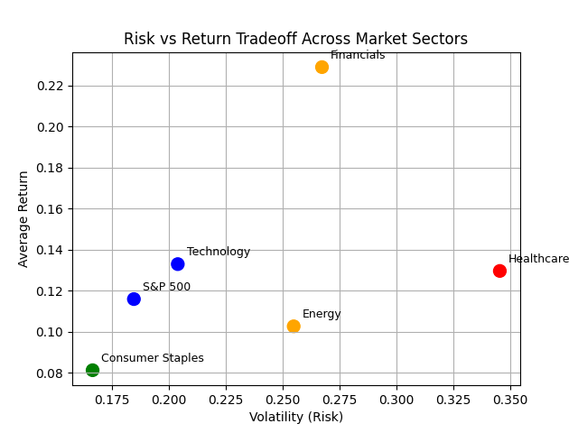

# U.S. Equity Sector Risk-Return Analysis

## Overview
This project analyzes the performance and risk characteristics of major U.S. equity sectors using Python. It compares cumulative returns and volatility to evaluate how different sectors behave under varying market conditions.

## Objective
The goal is to understand the tradeoff between risk and return across sectors and identify which sectors offer the most attractive investment profiles.

## Sectors Analyzed
- Technology (XLK)
- Healthcare (XLV)
- Energy (XLE)
- Financials (XLF)
- Consumer Staples (XLP)
- S&P 500 (SPY)

## Tools Used
- Python
- pandas
- numpy
- matplotlib
- yfinance

## Key Insights
- Financials delivered the highest return but also exhibited high volatility
- Technology provided strong returns with moderate risk
- Consumer Staples showed the lowest volatility but also the lowest return
- Healthcare had the highest volatility without strong return performance

## Visualizations

### Cumulative Returns

### Risk vs Return

## Conclusion
Technology offers a strong balance between growth and risk, while Financials provide higher return potential with increased volatility. A combination of both sectors can create a balanced investment strategy.
